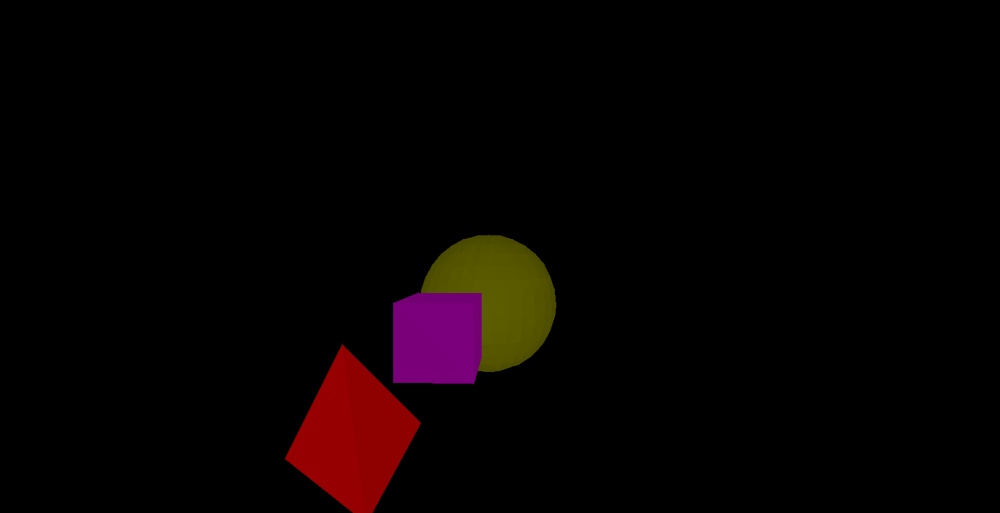
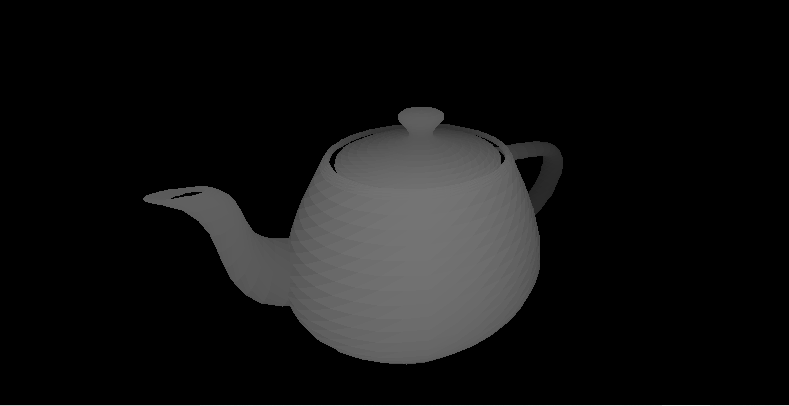
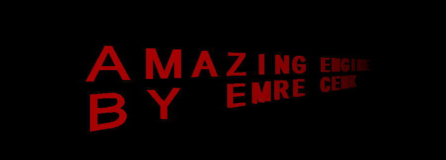

# Amazing-3D-Engine-A3E-

## What is Amazing Engine?
Amazing Engine is a 3D graphics Engine that brings a third dimension to pygame.
Pygame is a 2d python graphics library that currently does not have a 3D version. This project changes that.
You can use this engine to either create 3d games from scratch, or to add 3d graphics to existing pygame games

## Example Images/Gifs (don't forget to add gifs)


### Some built in shape examples:


#### Example of an imported obj file:


#### Inserting Text Onto The 3D world:


## Getting Started
Getting set up with Amazing Engine is a very easy process.
##### Importing and initializing engine:
There are 3 mandatory arguments you need to provide when initializing the engine:
* The screen width
* The screen height
* The current working directory 
* The name of the script you are currently running
```python
from graphics.managing_graphics import Engine
import os
screen_width = 800
screen_height = 600
script_name = "my_script"
my_engine = Engine(screen_width, screen_height, os.getcwd(), script_name, delay_time=25)

```

## Creating 3D objects:
Amazing Engine has a variety of 3d shapes such as Cubes, Pyramids and Spheres. The Engine even supports .obj files.

### Initializing built in shapes:
Most 3d shapes have a general rule when initializing:
* The first argument is an array that specifies the coordinates of the center
* The second argument is an integer that specifies what the side length, radius, or height is
    For instance, 
    
    for cubes, the second argument specifies the side length,
    
    for pyramids, the second argument specifies the height
    
    for spheres, the second argument specifies the radius 

* The third argument is what color you want the object to be
```python
import models.shapes_3d as sh3
from graphics.managing_graphics import Engine
import os
my_engine = Engine(600, 800, os.getcwd(), "script_name", delay_time=25) # initializing engine

#Initializing 3d objects:
example_cube = sh3.Cube([10, 0, -10], 5, (255, 0, 255)) #A cube with center at [10, 0, -10] with a side length of 5
example_pyramid = sh3.Pyramid([25, 0, -10], 5, (255,0,0)) #A pyramid with center at [25, 0, -10] with a height of 5
example_sphere = sh3.Sphere([0,0,-10], 8, (255,255,0)) #A sphere with center at [0, 0, -10] with a radius of 5

#Adding the objects to the Engine:
my_engine.add_model(example_cube)
my_engine.add_model(example_pyramid)
my_engine.add_model(example_sphere)
```

Note: Whenever you create a new 3d object, you need to call the Engine.add_model function. Otherwise your 3d object will
not be rendered.

####

### Importing .obj files:

To import a .obj file to the engine, you need to use the obj_mesh class.
When initializing, you need to specify two values:
1) The path to the object
2) The desired color of the object

An example:
```python
from graphics.managing_graphics import Engine
import os
from models.using_obj_files.using_obj_files import obj_mesh
my_engine = Engine(600, 800, os.getcwd(), "script_name", delay_time=25) # initializing engine
mesh_object = obj_mesh("using_obj_files/sample_object_files/utah_teapot.obj", color = (0,255,255))

my_engine.add_model(mesh_object) #This function must be called when you create any 3d object
```


At this point, the mesh_object class can be treated as if it was any other built in shape.
Any method that is valid for a 3d shape object is also valid for a mesh_class object.
 


 
### Universal Methods for all 3D objects:
All 3d objects have some common methods that can be called. (These 3d objects can be an obj_mesh class, or any other
 built in shape such as cubes, pyramids or spheres)

#### Moving objects
In order to shift an object, you call the 'shift' method for the object. The shift method takes in two inputs:
1) axis: a string "x", "y" or "z". Instead of the axis values as strings, you can also input 0, 1, and 2 respectively.
2) amount: an integer, how much to shift the object by

```python
from models.using_obj_files.using_obj_files import obj_mesh
mesh_object = obj_mesh("using_obj_files/sample_object_files/utah_teapot.obj", color = (0,255,255))

mesh_object.shift("x",  10) #moves the object 10 units along the x axis
mesh_object.shift("y", -10) #moves the object -10 units along the y axis
mesh_object.shift(axis = "z", amount = -10) #moves the object -10 units along the z axis

```

#### Rotating objects
To rotate an object, you call the .rotate method. Takes in two inputs:
1) axis: The axis to rotate around, any string "x", "y", "z" or the integers 0, 1, 2 respectively
2) angle: How many degrees to rotate the object by, any float (By default, the input is in degrees, NOT RADIANS)

The rotate method also takes in one keyword arguement which is False by default:
3) radian_input: a boolean value specifying whether the input is in radians, when the input is True, the amount
 argument will be treated as radians
 
```python
from models.using_obj_files.using_obj_files import obj_mesh
mesh_object = obj_mesh("using_obj_files/sample_object_files/utah_teapot.obj", color = (0,255,255))

mesh_object.rotate("x", 10) #rotates the mesh_object by 10 degrees along the x axis
mesh_object.rotate(axis = "y", angle = 1, radian_input=True) #rotates the mesh_object by 1 radian along the y axis
```
 
#### Using The Camera
The camera is an instance attribute that belongs to your Engine object.
The camera is accessed via Engine.camera
The shift and rotate functions also apply to the camera.

```python
from graphics.managing_graphics import Engine
import os
my_engine = Engine(600, 800, os.getcwd(), "script_name", delay_time=25) # initializing engine

my_engine.camera.shift("x", 10) # moves the Camera along the x axis by 20 units
my_engine.camera.rotate("z", 12) #rotates the camera along the z axis by 12 degrees

```

### Adjusting the Lighting:
For now, the lighting is glued to the camera. You can customize how bright the light is by changing the "luminosity
" attribute of the engine's light.
```python
from graphics.managing_graphics import Engine
import os
my_engine = Engine(600, 800, os.getcwd(), "script_name", delay_time=25) # initializing engine

my_engine.light.luminosity = 50 #The light can light up to 50 units around itself
```

#### The update function:
Once you have initialized the engine and created your 3D objects, you will need to create a function named 'update'.
The 'update' function will be called before every frame is rendered. 

#### The Engine.start_engine() method:
Starts the mainloop of the game. In every frame, the update() function inside your script is called once


## Example Animations

### Example animation of a rotating pyramid:
```python
from graphics.managing_graphics import Engine
import os
import models.shapes_3d as sh3
screen_width = 800
screen_height = 600
script_name = "rotating_cube"
engine = Engine(screen_width, screen_height, os.getcwd(), script_name, delay_time=25)
ex_pyramid = sh3.Pyramid(center_coordinates=[0,0,-10],
            color = (255,255,255),
            side_length=10)

engine.add_model(ex_pyramid)

def update():
    ex_pyramid.rotate("x", engine.delta_time*40)
    ex_pyramid.rotate("y", engine.delta_time*40)
    engine.render_frame()
engine.start_engine()

```


maybe:
This means that you can import any 3d model that you create in blender. All you need to do this
 export -> export as .obj.
Before exporting, inside the geometry settings,  uncheck all of the boxes except "Triangulate Faces".